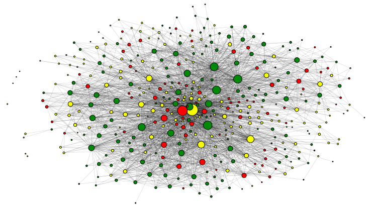
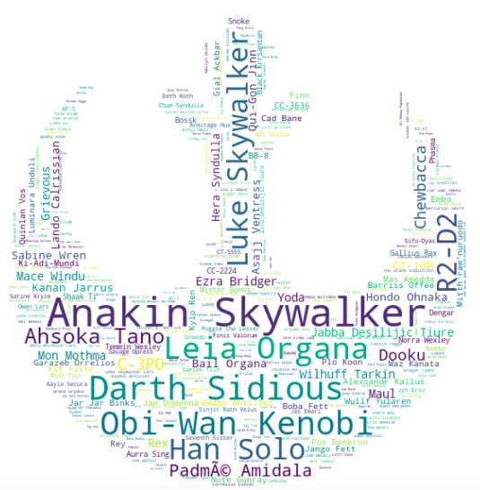

# Below is seen various markdown examples

## Images

## Tables

First Header | Second Header
------------ | -------------
Content from cell 1 | Content from cell 2
Content in the first column | Content in the second column

## Trying some link stuff

Link to our github: [Starwars Social Graphs](https://github.com/JacobPjetursson/Social_Graphs_Wookiepedia)

## Quotes

This is a code `quote` 